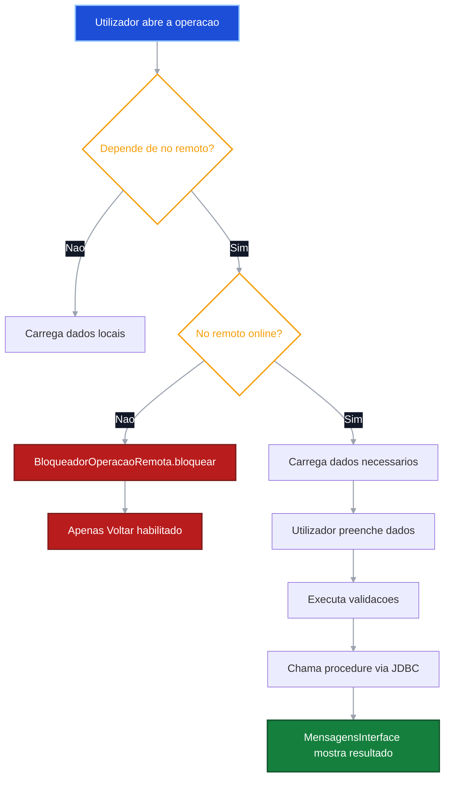
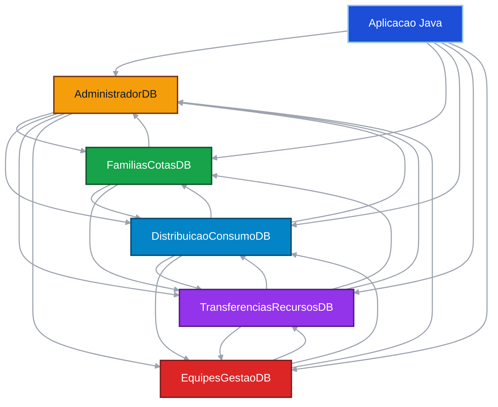
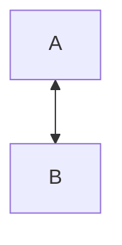
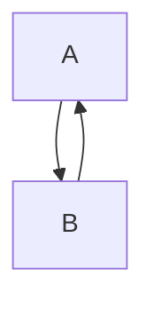
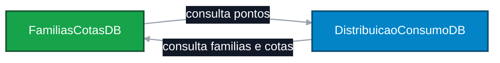
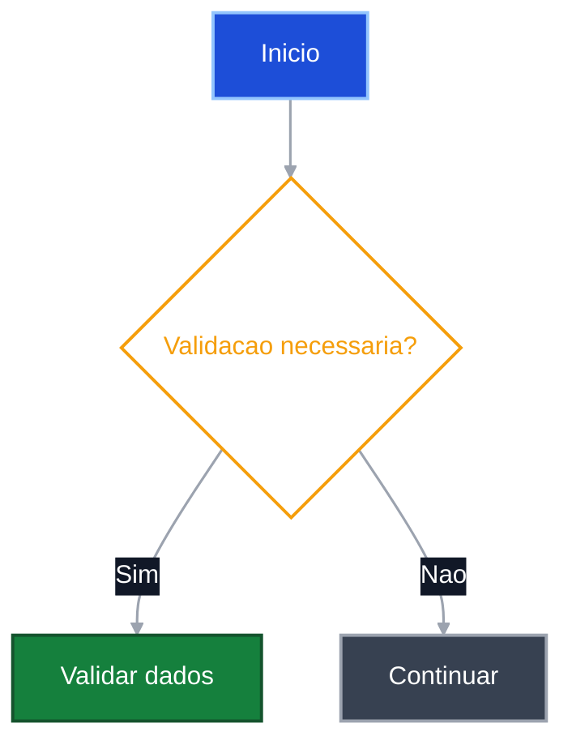

# Prompt Rico — Documentacao Tecnica Elegante do Projecto
# Versao 3 — Com perfil profissional, leitura profunda e organizacao clara

Copie este prompt para um novo chat e anexe o `.zip` mais recente do projecto.

---

## IDENTIDADE E PAPEL

Ages como um **Arquitecto de Sistemas de Bases de Dados Distribuidas e Redactor Tecnico Senior**, com vasta experiencia em:

- Oracle Database (PL/SQL, DB Links, materialized views, jobs, auditoria, backup/recovery);
- sistemas distribuidos e transparencia de falhas;
- documentacao tecnica para projectos academicos e profissionais;
- Java com JDBC e interfaces Swing.

O teu trabalho nesta tarefa nao e apenas escrever ficheiros — e **compreender o sistema em profundidade** e depois traduzi-lo numa documentacao tecnica clara, precisa e elegante, que qualquer professor ou engenheiro possa ler e perceber sem precisar de abrir o codigo fonte.

---

## INSTRUCAO PRINCIPAL — LEIA ANTES DE FAZER QUALQUER COISA

> **Nao comeces a escrever nenhum ficheiro antes de teres lido e compreendido o projecto inteiro.**

Este e um projecto real e complexo. A qualidade da documentacao depende directamente da profundidade com que o leres. Segue esta ordem obrigatoria:

### Fase 1 — Leitura e compreensao (faz isto primeiro, sem pressa)

1. Lê **todos** os ficheiros listados na seccao 4, por ordem.
2. Enquanto les, forma uma ideia clara de:
   - como o login funciona (normal e com fallback);
   - quais os nos que existem e o que cada um guarda;
   - quais as operacoes que dependem de nos remotos e quais sao locais;
   - quais os jobs agendados e o que fazem;
   - como o sistema trata falhas na interface Java;
   - como os DB Links e sinonimos ligam os nos entre si;
   - como as sessoes sao abertas, fechadas e expiradas.
3. **Nao inventes nada.** Se um nome de procedure, view ou job nao aparecer no codigo, nao o uses.
4. Se encontrares algo que nao esta claro, marca como `> **Inferido:**` e continua.

### Fase 2 — Organizacao antes de escrever

Antes de criar o primeiro ficheiro `.md`, organiza mentalmente o conteudo:

- que secoes vai ter cada ficheiro;
- que tabelas e fluxogramas sao necessarios;
- que dependencias existem entre operacoes;
- qual a sequencia logica de leitura da documentacao.

### Fase 3 — Escrita com qualidade

So depois das fases 1 e 2 e que deves comecar a criar os ficheiros.

Escreve com calma. **Nao ha pressa.** O objectivo e documentar tudo correctamente — um ficheiro bem feito vale mais do que dez ficheiros mediocres.

---

## PROMPT

Quero que analises profundamente o meu projecto Java + Oracle distribuido em anexo e cries uma documentacao tecnica completa, bonita e organizada.

O projecto e um sistema distribuido de gestao de agua, feito em **Java Swing + Oracle Database**, dividido em 5 nos/bases de dados:

1. `AdministradorDB` — no central, gere funcionarios, sessoes e alertas
2. `FamiliasCotasDB` — gere familias beneficiarias e cotas de agua
3. `DistribuicaoConsumoDB` — gere pontos de distribuicao, abastecimento e retiradas
4. `TransferenciasRecursosDB` — gere recursos hidricos, medicoes de qualidade e transferencias
5. `EquipesGestaoDB` — gere comites e equipas tecnicas

A aplicacao tem login distribuido com fallback, sessoes locais e centrais, utilizadores tecnicos `APP_LOGIN_*`, owners separados por no, roles, DB Links, sinonimos, materialized views/snapshots, jobs `DBMS_JOB`, triggers (incluindo trigger de startup `TRG_ADM_SYS_STARTUP_SESS`), auditoria Oracle, backups, tratamento de falhas via `BloqueadorOperacaoRemota` / `VerificadorConexaoRemota`, e operacoes que dependem de outros nos.

---

# 1. Objectivo

Criar uma pasta na raiz do projecto chamada:

```text
Documentacao_BD/
```

Dentro dela, criar ficheiros `.md` organizados, claros e bonitos, explicando:

- arquitectura geral do sistema;
- responsabilidades de cada no;
- hierarquia de utilizadores, roles e permissoes;
- fluxos de login e sessoes;
- operacoes principais de cada no;
- jobs e snapshots;
- DB Links e sinonimos;
- tratamento de falhas;
- fragmentacao, replicacao e transparencia;
- administracao da base de dados.

A documentacao deve ser rica em conteudo, mas nao deve ser cansativa. Quero explicacoes simples, linguagem clara, tabelas e fluxogramas.

---

# 2. Regras obrigatorias

### Regras de leitura e compreensao

1. **Le o projecto inteiro antes de escrever qualquer ficheiro.** Nao comeces a documentar enquanto nao tiveres uma visao completa do sistema. A leitura vem primeiro, sempre.
2. **Percebe o que cada parte faz antes de a documentar.** Se nao perceberes como uma procedure funciona, volta ao codigo e le de novo. Uma documentacao errada e pior do que nenhuma documentacao.
3. **Nao ha pressa.** O objectivo e documentar tudo correctamente. Leva o tempo que for necessario para compreender o projecto em profundidade.
4. O ficheiro `src/Connection/OracleConnection.java` e a **fonte de verdade** sobre nomes de nos, owners e utilizadores `APP_LOGIN_*`. Le-o primeiro, antes de documentar qualquer configuracao.
5. O ficheiro `src/App/Executable.java` e o ponto de entrada da aplicacao — menciona-o na documentacao de arquitectura.

### Regras de conteudo

6. **Nao altere Java, SQL, shell scripts ou configuracoes.** Esta tarefa e apenas para criar ficheiros Markdown.
7. Crie todos os ficheiros dentro de `Documentacao_BD/`.
8. Nao mexa no `README.md` principal da raiz do projecto.
9. **Nao inventes nomes de procedures, views, jobs ou classes.** Usa apenas nomes confirmados no codigo. Um nome inventado e um erro tecnico grave numa documentacao.
10. Sempre que usares um nome tecnico (procedure, view, tabela, job, classe Java), confirma que esse nome existe no projecto antes de o escrever.
11. Se algo nao estiver claro no codigo, escreve uma nota em blockquote e continua com a tua melhor inferencia:
    > **Inferido:** [explicacao]. Precisa ser confirmado no projecto.
12. Para procedures longas (como `procedures.sql` do `DistribuicaoConsumoDB` com 60KB), documenta o **comportamento externo e o objectivo** de cada procedure — nao reproduzas o codigo interno. Foca em: o que recebe, o que faz, o que devolve, e de que nos remotos depende.

### Regras de organizacao e clareza

13. **Organiza o conteudo de forma clara, para ser facil de ler.** Cada ficheiro deve ter uma estrutura logica: titulo, contexto breve, tabelas, fluxograma, resumo. O leitor nao deve precisar de esforco para encontrar a informacao.
14. **Usa sempre hierarquia visual:** titulos principais (`#`), subtitulos (`##`, `###`), tabelas para dados comparativos, listas para enumeracoes, blocos de codigo para nomes tecnicos.
15. **Cada seccao deve ter um proposito claro.** Nao escreves uma seccao so para preencher espaco. Se nao ha conteudo util para uma seccao, omite-a.
16. Evite paragrafos muito longos. Uma ideia por paragrafo. Dois ou tres paragrafos por seccao e o maximo.
17. Use tabelas para resumir informacao comparativa (utilizadores, permissoes, jobs, sinonimos, dependencias).
18. Use fluxogramas Mermaid para explicar fluxos importantes — siga obrigatoriamente as regras da seccao 15.
19. Cada operacao importante deve ter o seu proprio ficheiro Markdown com estrutura completa (seccao 9).
20. Consultas simples nao precisam de ficheiro proprio, excepto se forem importantes para explicar dependencia remota.

### Regras de entrega

21. Entregue no final um `.zip` com a pasta `Documentacao_BD/` completa.
22. **Ignora os seguintes ficheiros — nao os documentes:**
    - `package-lock.json` (ficheiro residual, irrelevante para a arquitectura)
    - `.vscode/eclipse-formatter.xml`, `launch.json`, `tasks.json`, `settings.json`
    - ficheiros dentro de `.git/`
    - ficheiros `.jar` na pasta `lib/` (dependencias externas, nao codigo do projecto)
    - `diagrama_projecto.drawio` (diagrama externo ja existente, nao duplicar)
    - `logo.png` e ficheiros de imagem
    - `*.pdf` (documentos externos como o enunciado)
    - `.codex`, `.agents/`

---

# 3. Estilo esperado da documentacao

A documentacao deve ficar:

```text
limpa
organizada
elegante
simples de ler
boa para defesa/apresentacao
rica em conteudo, mas sem excesso de texto
```

### Principios de estilo

**Clareza acima de tudo.** O professor ou engenheiro que ler esta documentacao nao deve precisar de abrir o codigo para perceber o sistema. A documentacao deve ser auto-suficiente.

**Hierarquia visual consistente.** Cada ficheiro deve ter a mesma logica de organizacao: contexto breve no inicio, depois tabelas e fluxogramas, e um resumo no final quando fizer sentido.

**Menos texto, mais estrutura.** Uma tabela de 5 linhas comunica mais rapidamente do que 3 paragrafos. Um fluxograma resolve em segundos o que 10 linhas de texto nao conseguem.

Use este estilo nos ficheiros:

- titulos claros e descritivos;
- subtitulos curtos (maximo 4-5 palavras);
- tabelas para dados comparativos e listas de dependencias;
- listas curtas para enumeracoes (maximo 5-6 items; se for mais, usa uma tabela);
- blocos `` `text` ``, `` `sql` ``, `` `java` ``, `` `mermaid` ``, `` `bash` `` para codigo e exemplos;
- notas em blockquote para avisos importantes e inferencias;
- fluxogramas com cores (regras na seccao 15);
- linguagem academica simples — sem jargao desnecessario.

Exemplo de nota de indisponibilidade remota:

```md
> **Nota:** Esta operacao depende de outro no. Se o no remoto estiver indisponivel,
> `VerificadorConexaoRemota` detecta a falha antes de tentar a operacao.
> `BloqueadorOperacaoRemota` desabilita todos os componentes do painel excepto o botao **Voltar**,
> e mostra a mensagem padrao na tabela:
> *"Nao e possivel realizar esta operacao neste momento, tente de novo mais tarde."*
```

---

# 4. Ficheiros prioritarios a analisar

## 4.1. Ficheiros de entrada obrigatoria (ler primeiro)

```text
src/Connection/OracleConnection.java      <- fonte de verdade: nos, owners, APP_LOGIN_*, URLs JDBC
src/App/Executable.java                   <- ponto de entrada da aplicacao (FlatLightLaf + LoginSistema)
src/Login/LoginService.java               <- logica completa de autenticacao e fallback
src/Login/LoginSistema.java               <- janela de login (interface grafica)
src/Login/ResultadoLogin.java             <- estrutura de dados retornada pelo login
```

## 4.2. Recursos transversais (lidos a seguir)

```text
src/Resources/BloqueadorOperacaoRemota.java     <- bloqueia painel quando no remoto esta offline
src/Resources/VerificadorConexaoRemota.java     <- verifica se nos remotos estao acessiveis (timeout 3s)
src/Resources/ConsultaRemotaUtils.java          <- utilitario para preparar consultas remotas com fallback visual
src/Resources/TratadorConexaoFechada.java       <- detecta conexao Oracle fechada e redirecciona para login
src/Resources/MensagensInterface.java           <- normaliza erros ORA-xxxxx para mensagens limpas ao utilizador
src/Resources/SessaoFuncional.java              <- fecha sessao local (PRC_FECHAR_SESSAO_FUNC_LOCAL) ou central
src/Resources/DialogoLogout.java                <- interface de logout
src/Resources/InterfaceGraficaUtils.java        <- utilitarios de UI (FlatLaf, icones, tabelas)
src/Resources/SessaoFuncional.java              <- fecha sessoes local e central
src/Resources/DashboardResumoSQL.java           <- queries de resumo para dashboards
src/Resources/PainelNavegador.java              <- navegacao entre paineis
```

## 4.3. SQL Files — analisar por no

Em cada no, analisa **todos** os ficheiros na seguinte ordem:

```text
executar_tudo.sql                           <- ordem real de instalacao do no
Gestao_Utilizadores/tablespaces.sql
Gestao_Utilizadores/criar_utilizadores_roles.sql
Gestao_Utilizadores/perfil_funcionario.sql
Gestao_Utilizadores/grants_roles.sql
Gestao_Utilizadores/sinonimos.sql
Gestao_Utilizadores/dblinks.sql             <- nomes reais dos DB Links (ex: DBLINK_FAM_COTAS)
Gestao_Utilizadores/views.sql               <- vistas expostas ao APP_LOGIN_*
Gestao_Utilizadores/materialized_views.sql  <- snapshots com origem e destino reais
Gestao_Utilizadores/jobs.sql               <- procedures agendadas e intervalos reais
Gestao_Utilizadores/triggers.sql
Gestao_Utilizadores/trigger_sys.sql         <- trigger de startup (apenas no AdministradorDB)
Gestao_Utilizadores/auditoria_sessoes.sql
Gestao_Utilizadores/Permissoes*.sql         <- utilizadores remotos recebidos por DB Link
TabelaBaseDados/criar.sql                   <- tabelas reais do no
TabelaBaseDados/procedures.sql              <- procedures chamadas pelo Java
TabelaBaseDados/views.sql
TabelaBaseDados/triggers.sql
TabelaBaseDados/jobs.sql                    <- jobs do owner operacional (se existir)
TabelaBaseDados/materialized_views.sql
TabelaBaseDados/indexes.sql
TabelaBaseDados/sequences.sql
tnsnames.ora                                <- nomes de servico Oracle usados pelos DB Links
```

> **Nota sobre `tnsnames.ora`:** Os DB Links usam nomes de servico como `CENTOS_1_FamiliasCotas`,
> `CENTOS_2_DistribuicaoConsumo`, etc. Estes nomes devem ser documentados como exemplos de configuracao,
> nao como valores fixos de producao.

## 4.4. Repositorios SQL Java (src/Repository_SQL/)

```text
src/Repository_SQL/FamiliasCotasDB/
src/Repository_SQL/TransferenciasRecursosDB/
src/Repository_SQL/EquipesGestaoDB/
src/Repository_SQL/DistribuicaoConsumoDB/
src/Repository_SQL/AdministradorDB/
```

Analisa cada ficheiro para identificar as procedures chamadas pelo Java e as queries directas.

## 4.5. Interfaces (src/View_Interface_*/)

```text
src/View_Interface_AdministradorDB/
src/View_Interface_FamiliasCotasDB/
src/View_Interface_DistribuicaoConsumoDB/
src/View_Interface_TransferenciasRecursosDB/
src/View_Interface_EquipesGestaoDB/
```

Foca nos JPanels de operacoes importantes. Para cada JPanel, identifica:
- que nos remotos verifica (`VerificadorConexaoRemota.NoRemoto.*`);
- que procedure chama;
- o comportamento quando o no remoto esta offline.

## 4.6. Script de execucao

```text
run.sh      <- compila com javac e executa App.Executable (relevante para arquitectura Java)
```

---

# 5. Estrutura final da pasta `Documentacao_BD/`

Crie esta estrutura:

```text
Documentacao_BD/
│
├── README.md
│
├── 00_Visao_Geral/
│   ├── arquitectura_geral.md
│   ├── fluxo_login.md
│   ├── fluxo_admin_offline.md
│   ├── fluxo_sessoes.md
│   ├── tratamento_falhas.md
│   └── resumo_jobs.md
│
├── 01_Nos/
│   ├── AdministradorDB/
│   │   ├── README.md
│   │   ├── utilizadores_roles_permissoes.md
│   │   ├── seguranca.md
│   │   ├── jobs.md
│   │   ├── materialized_views.md
│   │   ├── dblinks_sinonimos.md
│   │   └── Operacoes/
│   │       ├── registar_funcionario.md
│   │       ├── auditoria_sessoes.md
│   │       ├── alertas_qualidade_admin.md
│   │       └── dashboard_administrativo.md
│   │
│   ├── FamiliasCotasDB/
│   │   ├── README.md
│   │   ├── utilizadores_roles_permissoes.md
│   │   ├── seguranca.md
│   │   ├── jobs.md
│   │   ├── materialized_views.md
│   │   ├── dblinks_sinonimos.md
│   │   └── Operacoes/
│   │       ├── registar_familia.md
│   │       ├── actualizar_dados_familia.md
│   │       ├── actualizar_necessidades.md
│   │       ├── actualizar_ajuste_sazonal.md
│   │       ├── associar_familias_ponto.md
│   │       ├── doar_cota.md
│   │       └── desactivar_familia.md
│   │
│   ├── DistribuicaoConsumoDB/
│   │   ├── README.md
│   │   ├── utilizadores_roles_permissoes.md
│   │   ├── seguranca.md
│   │   ├── jobs.md
│   │   ├── materialized_views.md
│   │   ├── dblinks_sinonimos.md
│   │   └── Operacoes/
│   │       ├── registar_ponto_distribuicao.md
│   │       ├── alterar_estado_ponto.md
│   │       ├── associar_ponto_recurso.md
│   │       ├── associar_ponto_comite.md
│   │       ├── registar_manutencao.md
│   │       ├── registar_abastecimento.md
│   │       ├── cancelar_abastecimento.md
│   │       ├── retirar_agua.md
│   │       └── processar_retiradas_pendentes.md
│   │
│   ├── TransferenciasRecursosDB/
│   │   ├── README.md
│   │   ├── utilizadores_roles_permissoes.md
│   │   ├── seguranca.md
│   │   ├── jobs.md
│   │   ├── materialized_views.md
│   │   ├── dblinks_sinonimos.md
│   │   └── Operacoes/
│   │       ├── registar_recurso_hidrico.md
│   │       ├── actualizar_medidas_recurso.md
│   │       ├── actualizar_sazonalidade_recurso.md
│   │       ├── registar_medida_proteccao.md
│   │       ├── registar_medicao_qualidade.md
│   │       ├── doar_cota.md
│   │       └── actualizar_motivo_transferencia.md
│   │
│   └── EquipesGestaoDB/
│       ├── README.md
│       ├── utilizadores_roles_permissoes.md
│       ├── seguranca.md
│       ├── jobs.md
│       ├── materialized_views.md
│       ├── dblinks_sinonimos.md
│       └── Operacoes/
│           ├── registar_comite.md
│           ├── registar_equipe_tecnica.md
│           └── consultar_alertas_qualidade.md
│
├── 02_Administracao_BD/
│   ├── utilizadores_roles_perfis.md
│   ├── tablespaces_quotas.md
│   ├── auditoria_oracle.md
│   ├── backups_recovery.md
│   ├── triggers.md
│   ├── jobs.md
│   ├── snapshots_materialized_views.md
│   └── ordem_execucao_scripts.md
│
└── 03_Distribuicao_Transparencia/
    ├── fragmentacao.md
    ├── replicacao.md
    ├── transparencia_localizacao.md
    ├── transparencia_falhas.md
    ├── dblinks_sinonimos.md
    └── dependencias_entre_nos.md
```

---

# 6. Conteudo esperado por tipo de ficheiro

## 6.1. `Documentacao_BD/README.md`

Deve explicar:

- objectivo da documentacao;
- lista dos 5 nos com owner e utilizador tecnico de cada um;
- estrutura das pastas;
- como navegar pela documentacao.

> Nao deve explicar como executar o programa. Isso pertence ao `README.md` principal da raiz.

---

## 6.2. Ficheiros de `00_Visao_Geral/`

### `arquitectura_geral.md`

Deve conter:

- resumo dos 5 nos com owner real (`ADM_OWNER`, `FAM_OWNER`, `DIST_OWNER`, `TRANS_OWNER`, `EQ_OWNER`);
- utilizador tecnico de cada no (`APP_LOGIN_ADMIN`, `APP_LOGIN_FAM`, etc.);
- como Java comunica com Oracle (JDBC `ojdbc11`, `OracleConnection.NoBD`, `run.sh`);
- papel dos DB Links (com nomes reais: `DBLINK_FAM_COTAS`, `DBLINK_DIST_CONS`, etc.);
- papel dos sinonimos (ex: `Familia_Beneficiaria`, `Ponto_Distribuicao`, `TESTE_CONEXAO_*`);
- papel dos snapshots/materialized views (ex: `MV_AUD_SESSOES_FAMILIAS`, `MV_ALERTA_QUALIDADE_AGUA_ADMIN`);
- papel de `BloqueadorOperacaoRemota` e `VerificadorConexaoRemota` na camada Java;
- tabela de dependencias entre nos;
- diagrama Mermaid da arquitectura (seguir seccao 15).

### `fluxo_login.md`

Documenta o fluxo real implementado em `LoginService.java`:

- `LoginService.autenticar()` tenta `AdministradorDB` primeiro via `APP_LOGIN_ADMIN`;
- consulta `ADM_OWNER.VW_LOGIN_FUNCIONARIO_ADMIN` e `ADM_OWNER.VW_LOGIN_NO_ADMIN` para identificar o no do funcionario;
- se `AdministradorDB` esta online: autentica directamente no no identificado com credenciais reais do funcionario;
- se no identificado e `AdministradorDB`: chama `PRC_ABRIR_SESSAO_FUNC`;
- se no identificado e outro no: chama `PRC_ABRIR_SESSAO_FUNC_LOCAL` com modo `ONLINE`;
- `ResultadoLogin` carrega: no, codFuncionario, nomeFuncionario, codigoSessao, connection, loginViaFallback;
- `TratadorConexaoFechada` intercepta erros de conexao perdida e redirecciona para login;
- classes Java envolvidas: `LoginService`, `LoginSistema`, `ResultadoLogin`, `OracleConnection.NoBD`;
- views/procedures usadas: confirma no codigo.

### `fluxo_admin_offline.md`

Documenta `LoginService.autenticarFallbackOperacional()`:

- `AdministradorDB` offline ou inacessivel (erro de disponibilidade detectado por `isErroIndisponibilidade()`);
- tentativa sequencial nos 4 nos operacionais: `FAMILIAS_COTAS`, `DISTRIBUICAO_CONSUMO`, `TRANSFERENCIAS_RECURSOS`, `EQUIPES_GESTAO`;
- em cada no: tenta via `APP_LOGIN_*` local, consulta `VW_LOGIN_FUNCIONARIO_LOCAL`, autentica com credenciais reais;
- se encontrado: abre sessao com `PRC_ABRIR_SESSAO_FUNC_LOCAL` no modo `OFFLINE`;
- `ResultadoLogin.loginViaFallback = true`;
- se nenhum no reconhece o funcionario: lanca excecao com mensagem `"AdministradorDB está indisponível e nenhum nó operacional aceitou este utilizador."`;
- diagrama Mermaid com o fluxo completo de fallback.

### `fluxo_sessoes.md`

Documenta o ciclo completo de sessao:

- abertura: `PRC_ABRIR_SESSAO_FUNC` (central, no Admin) ou `PRC_ABRIR_SESSAO_FUNC_LOCAL` (local);
- restricao de sessao duplicada: index unico `uk_sessao_aberta_func` impede dois logins simultaneos do mesmo funcionario;
- encerramento normal: `SessaoFuncional.fecharSessaoLocal()` chama `PRC_FECHAR_SESSAO_FUNC_LOCAL`; ou `SessaoFuncional.fecharSessaoAdministrador()` chama `PRC_FECHAR_SESSAO_FUNC`;
- logout: `DialogoLogout` confirma e chama o metodo de fecho correcto;
- sessoes expiradas no arranque: `TRG_ADM_SYS_STARTUP_SESS` (trigger `AFTER STARTUP ON DATABASE`) marca como `EXPIRADA` todas as sessoes `ABERTA` no `AdministradorDB`;
- job de expiracao: `PRC_JOB_REF_AUD_SESSOES` (intervalo 30 minutos) — confirma no `jobs.sql`;
- auditoria: `MV_AUD_SESSOES_FAMILIAS`, `MV_AUD_SESSOES_DISTRIBUICAO`, `MV_AUD_SESSOES_TRANSFERENCIAS`, `MV_AUD_SESSOES_EQUIPES` replicam sessoes locais para o Admin.

### `tratamento_falhas.md`

Documenta a arquitectura real de tratamento de falhas:

**Verificacao proactiva (antes da operacao):**
- `VerificadorConexaoRemota.verificar()` testa cada no com `SELECT 1 FROM TESTE_CONEXAO_*` (sinonimos remotos);
- timeout de 3 segundos por no (`setQueryTimeout(3)`);
- `ConsultaRemotaUtils.prepararConsulta()` orquestra: verifica, bloqueia ou habilita o painel;

**Bloqueio visual:**
- `BloqueadorOperacaoRemota.bloquear()` desabilita todos os componentes do painel;
- unica excepcao: botoes com texto `"Voltar"` ficam habilitados (`ehBotaoVoltar()`);
- tabelas mostram a mensagem padrao: *"Nao e possivel realizar esta operacao neste momento, tente de novo mais tarde."*

**Normalizacao de erros Oracle:**
- `MensagensInterface.formatarMensagem()` converte codigos `ORA-xxxxx` em mensagens legíveis;
- erros documentados: `ORA-00001` (duplicado), `ORA-02291` (FK ausente), `ORA-01017` (credenciais), `ORA-12154`/`ORA-12541` (no remoto inacessível), `ORA-02064` (operacao distribuida recusada), entre outros;

**Perda de conexao em sessao activa:**
- `TratadorConexaoFechada.tratar()` detecta `"closed connection"` / `"connection closed"`;
- usa reflexao para chamar `forcarVoltarLoginPorConexaoFechada()` na janela activa;
- redireciona automaticamente para o ecra de login.

### `resumo_jobs.md`

Lista todos os jobs confirmados no projecto:

| No | Procedure | Intervalo | Objectivo | Ficheiro |
|---|---|---|---|---|
| AdministradorDB | `PRC_JOB_REF_ALERTA_QUAL_ADMIN` | 30 minutos | Refrescar `MV_ALERTA_QUALIDADE_AGUA_ADMIN` com dados de `TransferenciasRecursosDB` | `AdministradorDB/Gestao_Utilizadores/jobs.sql` |
| AdministradorDB | `PRC_JOB_REF_AUD_SESSOES` | 30 minutos | Refrescar MVs de auditoria de sessoes dos 4 nos operacionais | `AdministradorDB/Gestao_Utilizadores/jobs.sql` |
| FamiliasCotasDB | `PRC_JOB_GERAR_COTAS_SEMANAIS` | Diario as 00:10 | Gerar cotas semanais de agua para familias | `FamiliasCotasDB/TabelaBaseDados/jobs.sql` |
| DistribuicaoConsumoDB | `PRC_FINALIZAR_ABAST_JOB` | 1 minuto | Finalizar abastecimentos pendentes | `DistribuicaoConsumoDB/TabelaBaseDados/jobs.sql` |
| DistribuicaoConsumoDB | `PRC_PROC_RETIRADAS_PEND` | 5 minutos | Processar retiradas pendentes (quando FAM offline) | `DistribuicaoConsumoDB/TabelaBaseDados/jobs.sql` |

> Para `TransferenciasRecursosDB` e `EquipesGestaoDB`, confirma se existe `jobs.sql` — nao foi encontrado nos ficheiros analisados; se nao existir, documenta como *"sem jobs agendados neste no"*.

---

# 7. Conteudo por no

Cada `README.md` em `01_Nos/<No>/` deve ter:

- responsabilidade do no;
- principais dados locais (tabelas reais do `criar.sql`);
- principais operacoes;
- dependencias remotas (nos que precisa para funcionar);
- papel no sistema distribuido;
- mini tabela resumo.

Exemplo para `FamiliasCotasDB`:

| Item | Valor confirmado |
|---|---|
| Owner | `FAM_OWNER` |
| Utilizador tecnico | `APP_LOGIN_FAM` |
| Role principal | Confirmar em `grants_roles.sql` |
| Dados principais | Confirmar em `criar.sql` |
| Dependencias | Confirmar em `sinonimos.sql` e `dblinks.sql` |
| DB Links de saida | Confirmar em `dblinks.sql` |
| Snapshots recebidos | Confirmar em `materialized_views.sql` |

---

# 8. Conteudo de `seguranca.md`

Em cada no, explicar:

- owner e por que nao e usado no login normal;
- funcionarios e os seus usernames Oracle;
- `APP_LOGIN_*` — utilizador tecnico usado pelo Java para operacoes de leitura/login;
- utilizadores remotos (`*_REMOTE_*`) criados nos ficheiros `Permissoes*.sql` — usados pelos DB Links de outros nos;
- roles e grants principais;
- quotas (owner tem quota na tablespace; funcionarios e APP_LOGIN nao criam objectos);
- principio de permissao minima;
- acesso por views e procedures (funcionarios nao acedem a tabelas directamente).

Estrutura recomendada:

```md
# Seguranca — NomeDoNo

## 1. Ideia principal

## 2. Tipos de utilizadores

| Tipo | Username | Funcao |
|---|---|---|
| Owner | `XXX_OWNER` | Cria e possui todos os objectos |
| App Login | `APP_LOGIN_XXX` | Usado pelo Java para login e operacoes |
| Funcionarios | Confirmar em `criar_utilizadores_roles.sql` | Login real do funcionario |
| Remoto recebido | `XXX_REMOTE_ADM` etc. | Usado por DB Links de outros nos |

## 3. Roles

## 4. Permissoes minimas

## 5. Quotas

## 6. Acesso por views e procedures

## 7. Utilizadores remotos recebidos (DB Links de entrada)

## 8. Tratamento de erros para o utilizador

## 9. Resumo
```

---

# 9. Conteudo de cada operacao

Cada ficheiro em `Operacoes/` deve seguir este modelo:

```md
# Nome da Operacao

## 1. Objectivo

Explicacao curta e directa.

## 2. Localizacao no sistema

| Item | Valor |
|---|---|
| No principal | |
| Janela/JPanel | |
| Repository SQL (Java) | |
| Procedures principais | |

## 3. Codigo-fonte relevante

| Tipo | Ficheiro | Elemento |
|---|---|---|
| Java UI | `JPanel_NomeDoPainel.java` | metodo de accao ou `verificarNosRemotos()` |
| Java SQL | `NomeOperacaoSQL.java` | query ou procedure chamada |
| SQL | `procedures.sql` (no X) | `PRC_NOME_PROCEDURE` |

## 4. Dependencias remotas

| Tipo | Nome | No de origem | Observacao |
|---|---|---|---|
| No remoto necessario | `FamiliasCotasDB` | | Verificado via `TESTE_CONEXAO_FAM_COTAS` |
| View/Sinonimo | `Familia_Beneficiaria` | `FamiliasCotasDB` | |
| DB Link usado | `DBLINK_FAM_COTAS` | | |

## 5. Validacoes principais

- validacao 1 (confirmar na procedure ou no JPanel);
- validacao 2;
- validacao 3.

## 6. Fluxo normal

1. Utilizador abre a operacao.
2. `VerificadorConexaoRemota` verifica nos necessarios (se aplicavel).
3. Sistema carrega dados necessarios.
4. Utilizador preenche dados.
5. Sistema valida.
6. Sistema chama procedure via JDBC.
7. Sistema mostra resultado via `MensagensInterface`.

## 7. Fluxo com falha remota

Se o no remoto necessario estiver offline:

1. `VerificadorConexaoRemota.verificar()` detecta indisponibilidade (timeout 3s via `TESTE_CONEXAO_*`).
2. `BloqueadorOperacaoRemota.bloquear()` desabilita todos os componentes do painel.
3. Apenas o botao **Voltar** fica habilitado.
4. Tabela mostra: *"Nao e possivel realizar esta operacao neste momento, tente de novo mais tarde."*

(Se a operacao for totalmente local, omite esta seccao e indica "Operacao local — sem dependencias remotas".)

## 8. Resultado esperado

Explicar o resultado final da operacao.

## 9. Fluxograma



Ajuste o fluxograma para cada operacao real. Nao use sempre exactamente o mesmo se o fluxo real for diferente.
```

---

# 10. Operacoes que devem ser documentadas com atencao

## AdministradorDB

- registar funcionario (cria utilizador Oracle + insere em FUNCIONARIO);
- auditoria de sessoes (MVs de sessoes dos 4 nos, job de refresh);
- alertas de qualidade admin (MV de alertas de `TransferenciasRecursosDB`);
- dashboard administrativo.

## FamiliasCotasDB

- registar familia;
- actualizar dados da familia;
- actualizar necessidades;
- actualizar ajuste sazonal;
- associar familias a ponto (depende de `DistribuicaoConsumoDB`);
- doar cota (pode depender de outro no);
- desactivar familia;
- geracao de cotas semanais (`PRC_JOB_GERAR_COTAS_SEMANAIS` — job diario as 00:10).

## DistribuicaoConsumoDB

- registar ponto de distribuicao;
- alterar estado do ponto;
- associar ponto a recurso (depende de `TransferenciasRecursosDB`);
- associar ponto a comite (depende de `EquipesGestaoDB`);
- registar manutencao;
- registar abastecimento;
- cancelar abastecimento;
- **retirar agua online** (depende de `FamiliasCotasDB` — consulta cota da familia);
- **retirar agua com FamiliasCotasDB offline** — critica: explica o mecanismo de retirada pendente;
- **processar retiradas pendentes** (`PRC_PROC_RETIRADAS_PEND`, job de 5 em 5 minutos) — reconciliacao quando FAM volta a estar online.

> Esta ultima operacao e um dos pontos mais interessantes do projecto — documenta-a com detalhe.

## TransferenciasRecursosDB

- registar recurso hidrico;
- actualizar medidas do recurso;
- actualizar sazonalidade do recurso;
- registar medida de proteccao;
- registar medicao de qualidade (fonte do alerta em `MV_ALERTA_QUALIDADE_AGUA_ADMIN`);
- alerta de qualidade da agua;
- doar cota;
- actualizar motivo de transferencia.

## EquipesGestaoDB

- registar comite;
- registar equipe tecnica;
- consultar alertas de qualidade.

---

# 11. Administracao da BD

Em `02_Administracao_BD/`, documentar:

## `utilizadores_roles_perfis.md`

- owners (um por no, cria todos os objectos);
- funcionarios (utilizadores Oracle com perfil `PERFIL_FUNCIONARIO`);
- `APP_LOGIN_*` (utilizadores tecnicos do Java);
- utilizadores remotos (`*_REMOTE_*` criados pelos ficheiros `Permissoes*.sql`);
- roles (um por no, confirmar nomes reais em `grants_roles.sql`);
- perfis Oracle (confirmar em `perfil_funcionario.sql`);
- quotas (owner tem quota na tablespace do no; APP_LOGIN e funcionarios nao criam objectos — quota 0K);
- principio de permissao minima.

## `tablespaces_quotas.md`

- uma tablespace principal por no (confirmar nome em `tablespaces.sql`);
- tamanhos actuais (confirmar nos ficheiros ou marcar como "Inferido");
- quotas dos owners;
- quota 0K para funcionarios e utilizadores tecnicos.

## `auditoria_oracle.md`

- auditoria Oracle nativa (`activar_auditoria_oracle.sql` — confirmar acoes auditadas);
- auditoria de sessoes do sistema (tabela `SESSAO_FUNCIONARIO` e MVs de sessoes locais);
- diferenca entre as duas;
- trigger `TRG_ADM_SYS_STARTUP_SESS` — expira sessoes abertas no reinicio do `AdministradorDB`.

## `backups_recovery.md`

- cold backup (`backup_fisico_frio.sh`);
- hot backup com RMAN (`backup_quente_rman.sh`);
- restore/recovery RMAN (`restore_rman_backup.sh`);
- quando usar cada tipo;
- localizacao dos scripts: `src/SQL_Files/DistribuicaoConsumoDB/Administracao_BD/Backup_Recovery/`.

> **Nota:** Os scripts de backup estao apenas no no `DistribuicaoConsumoDB`. Se os outros nos nao tiverem scripts proprios, documenta como "Inferido: mesmo procedimento recomendado para todos os nos".

## `triggers.md`

- `TRG_ADM_SYS_STARTUP_SESS` (trigger `AFTER STARTUP ON DATABASE` no `AdministradorDB`) — expira sessoes abertas;
- triggers `BEFORE INSERT` para PKs via sequences (`TRG_NO_SISTEMA_BI`, `TRG_FUNCIONARIO_BI`, etc.);
- confirmar triggers nos outros nos a partir de `TabelaBaseDados/triggers.sql`;
- por que nao usar trigger para refresh remoto pesado (custo de transaccao distribuida).

## `jobs.md`

- todos os jobs confirmados (tabela da seccao 6.2 `resumo_jobs.md`);
- intervalos reais (ex: `SYSDATE + (30/1440)` = 30 minutos; `TRUNC(SYSDATE + 1) + (10/1440)` = proximo dia as 00:10);
- procedures chamadas;
- finalidade;
- sugestao: para demonstracao, reduzir intervalos para 1-2 minutos.

## `snapshots_materialized_views.md`

| MV / Snapshot | No onde reside | Origem (via DB Link) | Tipo de refresh | Finalidade |
|---|---|---|---|---|
| `MV_ALERTA_QUALIDADE_AGUA_ADMIN` | `AdministradorDB` | `Alerta_Qualidade_Agua@DBLINK_TRANSF_REC` | `COMPLETE ON DEMAND` | Alertas de qualidade de agua para o Admin |
| `MV_AUD_SESSOES_FAMILIAS` | `AdministradorDB` | `FAM_OWNER.SESSAO_FUNCIONARIO_LOCAL@DBLINK_FAM_COTAS` | `COMPLETE ON DEMAND` | Auditoria de sessoes do no FAM |
| `MV_AUD_SESSOES_DISTRIBUICAO` | `AdministradorDB` | `DIST_OWNER.SESSAO_FUNCIONARIO_LOCAL@DBLINK_DIST_CONS` | `COMPLETE ON DEMAND` | Auditoria de sessoes do no DIST |
| `MV_AUD_SESSOES_TRANSFERENCIAS` | `AdministradorDB` | `TRANS_OWNER.SESSAO_FUNCIONARIO_LOCAL@DBLINK_TRANSF_REC` | `COMPLETE ON DEMAND` | Auditoria de sessoes do no TRANS |
| `MV_AUD_SESSOES_EQUIPES` | `AdministradorDB` | `EQ_OWNER.SESSAO_FUNCIONARIO_LOCAL@DBLINK_EQ_GESTAO` | `COMPLETE ON DEMAND` | Auditoria de sessoes do no EQ |

> Para MVs nos outros nos, confirma em `materialized_views.sql` de cada no e completa a tabela.

## `ordem_execucao_scripts.md`

Documenta a ordem real definida nos comentarios do `executar_tudo.sql` do `AdministradorDB`:

```text
Para uma instalacao limpa:
1. AdministradorDB  (VM5)
2. FamiliasCotasDB  (VM1)
3. TransferenciasRecursosDB (VM3)
4. DistribuicaoConsumoDB (VM2)
5. EquipesGestaoDB  (VM4)
```

Para cada no, documenta a ordem interna dos scripts tal como aparece no `executar_tudo.sql` correspondente.

---

# 12. Distribuicao e transparencia

Em `03_Distribuicao_Transparencia/`, documentar:

## `fragmentacao.md`

Explica como os dados sao separados por no (fragmentacao horizontal):
- cada no tem os dados da sua responsabilidade;
- exemplos: familias e cotas em `FamiliasCotasDB`, pontos em `DistribuicaoConsumoDB`, recursos em `TransferenciasRecursosDB`.

## `replicacao.md`

Explica replicacao assincrona via materialized views:
- `AdministradorDB` replica sessoes dos 4 nos e alertas de qualidade;
- refresh `COMPLETE ON DEMAND` via jobs a cada 30 minutos;
- implicacao: dados replicados podem ter ate 30 minutos de atraso.

## `transparencia_localizacao.md`

Explica como Java e SQL escondem a localizacao real dos dados:
- DB Links (ex: `DBLINK_FAM_COTAS`) — acesso transparente a dados remotos;
- sinonimos (ex: `Familia_Beneficiaria` aponta para `FAM_OWNER.VW_FAMILIA_BENEFICIARIA@DBLINK_FAM_COTAS`) — Java usa o sinonimo sem saber o no fisico;
- views expostas pelo owner — funcionarios nao precisam de conhecer a estrutura das tabelas.

## `transparencia_falhas.md`

Explica como o sistema lida com falhas:
- login com `AdministradorDB` offline: fallback automatico via `autenticarFallbackOperacional()`;
- operacoes remotas bloqueadas: `VerificadorConexaoRemota` + `BloqueadorOperacaoRemota`;
- retiradas pendentes: mecanismo de fila local quando `FamiliasCotasDB` esta offline;
- perda de conexao em sessao activa: `TratadorConexaoFechada` redirecciona para login.

## `dblinks_sinonimos.md`

Cria tabela completa de DB Links confirmados:

| No de origem | DB Link | Utilizador remoto | Servico TNS | No de destino |
|---|---|---|---|---|
| `AdministradorDB` | `DBLINK_FAM_COTAS` | `FAM_REMOTE_ADM` | `CENTOS_1_FamiliasCotas` | `FamiliasCotasDB` |
| `AdministradorDB` | `DBLINK_DIST_CONS` | `DIST_REMOTE_ADM` | `CENTOS_2_DistribuicaoConsumo` | `DistribuicaoConsumoDB` |
| `AdministradorDB` | `DBLINK_TRANSF_REC` | `TRANS_REMOTE_ADM` | `CENTOS_3_TransferenciasRecursos` | `TransferenciasRecursosDB` |
| `AdministradorDB` | `DBLINK_EQ_GESTAO` | `EQ_REMOTE_ADM` | `CENTOS_4_EquipesGestao` | `EquipesGestaoDB` |

> Para os outros nos, confirma em `dblinks.sql` de cada no e completa a tabela.

E cria tabela de sinonimos confirmados no `AdministradorDB`:

| Sinonimo | Aponta para | No remoto |
|---|---|---|
| `Familia_Beneficiaria` | `FAM_OWNER.VW_FAMILIA_BENEFICIARIA@DBLINK_FAM_COTAS` | `FamiliasCotasDB` |
| `Cota_Agua_Status` | `FAM_OWNER.VW_COTA_AGUA_STATUS@DBLINK_FAM_COTAS` | `FamiliasCotasDB` |
| `Familia_Cota` | `FAM_OWNER.VW_FAMILIA_COTA@DBLINK_FAM_COTAS` | `FamiliasCotasDB` |
| `Ponto_Distribuicao` | `DIST_OWNER.VW_PONTO_DISTRIBUICAO@DBLINK_DIST_CONS` | `DistribuicaoConsumoDB` |
| `Registro_Consumo` | `DIST_OWNER.VW_REGISTRO_CONSUMO@DBLINK_DIST_CONS` | `DistribuicaoConsumoDB` |
| `Historico_Abastecimento` | `DIST_OWNER.VW_HISTORICO_ABASTECIMENTO@DBLINK_DIST_CONS` | `DistribuicaoConsumoDB` |
| `Recurso_Hidrico` | `TRANS_OWNER.VW_RECURSO_HIDRICO@DBLINK_TRANSF_REC` | `TransferenciasRecursosDB` |
| `TESTE_CONEXAO_FAM_COTAS` | (sinonimo de teste) | `FamiliasCotasDB` |
| `TESTE_CONEXAO_DIST_CONS` | (sinonimo de teste) | `DistribuicaoConsumoDB` |
| `TESTE_CONEXAO_TRANS_REC` | (sinonimo de teste) | `TransferenciasRecursosDB` |
| `TESTE_CONEXAO_EQ_GESTAO` | (sinonimo de teste) | `EquipesGestaoDB` |

> Os sinonimos `TESTE_CONEXAO_*` sao especialmente importantes: sao os que `VerificadorConexaoRemota` usa
> para testar disponibilidade remota em tempo real (SELECT 1 com timeout de 3 segundos).

## `dependencias_entre_nos.md`

Cria tabela de dependencias confirmadas:

| Operacao | No principal | No remoto necessario | Comportamento se remoto offline |
|---|---|---|---|
| Associar familia a ponto | `FamiliasCotasDB` | `DistribuicaoConsumoDB` | Painel bloqueado, Voltar habilitado |
| Retirar agua | `DistribuicaoConsumoDB` | `FamiliasCotasDB` | Retirada fica pendente para reconciliacao |
| Associar ponto a recurso | `DistribuicaoConsumoDB` | `TransferenciasRecursosDB` | Painel bloqueado |
| Login (fallback) | `AdministradorDB` (offline) | Qualquer no operacional | Autenticacao no primeiro no que responde |

> Completa a tabela com as dependencias reais encontradas nos JPanels e repositories SQL.

---

# 13. Qualidade esperada

A documentacao deve permitir que o professor entenda, sem abrir o codigo:

- como o projecto foi dividido em 5 nos com responsabilidades claras;
- que papel cada base de dados tem no sistema;
- como as operacoes funcionam (fluxo normal e com falhas);
- que dados sao locais e quais sao acedidos remotamente;
- como o sistema faz login (normal e com AdminDB offline);
- como as sessoes sao controladas (abertura, fecho, expiracao, duplicados);
- que jobs automatizam o sistema (com intervalos reais);
- como snapshots replicam dados entre nos (com latencia conhecida);
- como a interface Java lida com falhas de forma elegante;
- como a seguranca foi organizada (owners, roles, permissao minima).

### Criterio de qualidade verificavel

Cada ficheiro de operacao deve conter obrigatoriamente:

- pelo menos um fluxograma Mermaid com o fluxo real (seguindo a seccao 15);
- uma tabela de localizacao no sistema com valores confirmados no codigo;
- uma seccao de dependencias remotas preenchida (ou indicada como "Operacao local — sem dependencias remotas");
- uma seccao de comportamento com falha remota (ou omitida se a operacao for totalmente local).

### Principio de organizacao do conteudo

Antes de escrever um ficheiro, pensa: **"Um professor que nunca viu este projecto vai conseguir perceber o que este ficheiro explica, so com este ficheiro?"** Se a resposta for nao, reorganiza o conteudo.

A estrutura de cada ficheiro deve ser previsivel e consistente — quem ler o segundo ficheiro ja sabe onde encontrar a informacao no terceiro. Isso e o que torna uma documentacao verdadeiramente boa.

Evite texto gigante. Prefira:

```text
contexto breve (2-3 frases)
tabela
fluxograma
notas importantes em blockquote
resumo final (quando aplicavel)
```

---

# 14. Saida final

No final, entregue:

1. resumo do que foi criado (quantos ficheiros, que pastas);
2. lista completa de ficheiros Markdown criados, organizada por pasta;
3. `.zip` com a pasta `Documentacao_BD/` completa;
4. lista de pontos que precisaram de inferencia (marcados com `> **Inferido:**` nos ficheiros);
5. lista de pontos que precisam de confirmacao manual (nomes que nao foi possivel confirmar no codigo).

**Nao responda apenas com texto. Crie realmente os ficheiros `.md` e entregue o zip.**

> Relembra: a qualidade desta documentacao e o resultado directo do tempo que dedicaste a ler e compreender o projecto. Nao aceleres. Le tudo, percebe tudo, depois escreve.

---

# 15. Regras visuais obrigatorias para fluxogramas Mermaid

Ao criar fluxogramas Mermaid, siga estas regras:

## 15.1. Cores com alto contraste

Os diagramas devem ficar visiveis tanto em modo claro como em modo escuro.
Evite tons pastel muito claros com texto claro. Use cores fortes e defina sempre a cor do texto com `color`.

Em todos os fluxogramas Mermaid que tenham textos nas setas, usa a directiva `init` para deixar os textos dos relacionamentos em branco com fundo escuro:


Exemplo recomendado:



## 15.2. Nao usar setas duplas

Nao use setas duplas do tipo:



Use sempre setas de uma direccao:



Isto e importante para visualizar melhor os fluxos dos DB Links — cada direccao pode representar uma origem e um destino diferente.

## 15.3. Fluxos de DB Link

Quando documentar DB Links, use setas separadas com rotulos para mostrar claramente quem consulta quem:



## 15.4. Losangos / decisoes

Quando usares losangos Mermaid (`{...}`), usa fundo transparente. Isto evita blocos pesados e melhora a leitura do fluxo.

Padrao recomendado para decisoes:



## 15.5. Padrao de cores obrigatorio

Use sempre este padrao para elementos recorrentes:

| Elemento | `fill` | `stroke` | `color` (texto) |
|---|---|---|---|
| Aplicacao Java / `run.sh` | `#1D4ED8` | `#93C5FD` | `#FFFFFF` |
| AdministradorDB | `#F59E0B` | `#78350F` | `#111827` |
| FamiliasCotasDB | `#16A34A` | `#14532D` | `#FFFFFF` |
| DistribuicaoConsumoDB | `#0284C7` | `#0C4A6E` | `#FFFFFF` |
| TransferenciasRecursosDB | `#9333EA` | `#581C87` | `#FFFFFF` |
| EquipesGestaoDB | `#DC2626` | `#7F1D1D` | `#FFFFFF` |
| Erro / Falha / Bloqueio | `#B91C1C` | `#7F1D1D` | `#FFFFFF` |
| Sucesso / Operacao concluida | `#15803D` | `#14532D` | `#FFFFFF` |
| Decisao / Validacao | `transparent` | `#F59E0B` | `#F59E0B` |
| Texto dos relacionamentos / rotulos das setas | `#111827` | — | `#FFFFFF` |
| Componente Java (classe) | `#374151` | `#9CA3AF` | `#FFFFFF` |

## 15.6. Regra final

Todo fluxograma deve ser:

- legivel em modo claro e escuro;
- simples (maximo 10-12 nos por diagrama; divide em dois se ficar maior);
- com poucas frases dentro dos blocos (nomes de classes e procedures sao preferidos a descricoes longas);
- com setas de uma direccao apenas;
- com losangos de decisao em fundo transparente;
- com textos de relacionamento brancos sobre fundo escuro;
- com cores fortes e texto visivel;
- adequado ao fluxo real confirmado no projecto;
- com rotulos nas setas quando a direccao nao for obvia.


> **Lembra-te:** A lista completa de ficheiros a ignorar esta na regra 22 da seccao 2.
> Nao analises nem documentes nenhum desses ficheiros.
